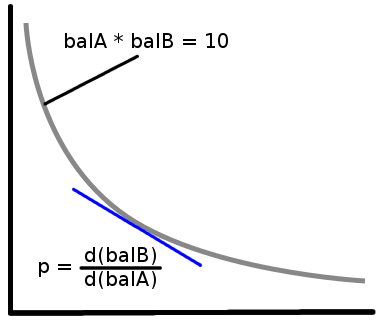

# Badger

**Build realtime apps under a single API. Badger is simple, fast, reliable and unifies data APIs of decentralized finance.**


# Disclosure

Badger is under heavy development and lots of things might change in the future, feedbacks are welcome at mauro@zinnion.com or [`@slashdowntown`](https://twitter.com/slashdowntown)

# Websocket

## Ticker

WebSocket endpoint provides real-time market data streaming which works in Subscribe-Publish communication model. After establishing a WebSocket connection with us, you will need to send a message with the channels you want to subscribe.

The fields `reserves` are calculated in real time every time that a new transaction is confirmed in the blockchain. To find a price-independent measure to understand pool size, growth, and transaction volume, we need to look at the trading formula at its heart in each of the protocols. For instnace Uniswap V2 depends on the "constant product" principle to govern trading — that is the product of the two liquidity pools should be the same after a trade as before (excluding fees). The Uniswap V2 price is given by the ratio of the two liquidity pools. The constant product is therefore price-independent.
While in Uniswap V2 the pools have weights equaly balanced, in Balancer it uses [`formula`](https://balancer.finance/whitepaper/#spot-price) where the spot price relies on `weights` associated to each token. 

Please go to the section [protocols](#Protocols) for more details and formulas for each of the supported protocols.

## Supported Protocols
- Uniswap V2 (Ethereum)
- Sushiswap (Ethereum)
- Balancer (Ethereum)
- Bancor (Ethereum)
- Curve (Ethereum)

## Channels 

* *TICKERS*

Return payload expected:

```json
{
  type: 'ticker',
  sequence: 19,
  protocol: 'UNISWAPV2',
  swap_fee: '3000',
  pool_id: '0xb4e16d0168e52d35cacd2c6185b44281ec28c9dc',
  block_number: 12089538,
  transaction_hash: '0xee4370c7529aa605b9cff71c182665ae5c27e4a8b5dddaf1b85cd99d6e429843',
  processed_timestamp: 1616428500,
  name: 'Uniswap V2',
  immutable: true,
  symbol: 'UNI-V2',
  decimals: '18',
  tokens: [
    {
      address: '0xa0b86991c6218b36c1d19d4a2e9eb0ce3606eb48',
      name: 'USD Coin',
      symbol: 'USDC',
      decimals: '6',
      weight: '500000',
      reserves: '134130853.304658'
    },
    {
      address: '0xc02aaa39b223fe8d0a0e5c4f27ead9083c756cc2',
      name: 'Wrapped Ether',
      symbol: 'WETH',
      decimals: '18',
      weight: '500000',
      reserves: '75374.524446197184817599'
    }
  ]
}
````

Messages are ordered in the same order as they occurred in the blocks, you can follow the field `sequence` to make sure you are not losing any message. The field `sequence` is incremental and `individial` **per protocol**, meaning, protocol `A` will have a different `sequence` than protocol `B`, the `sequence` also can eventually go back to `0`. You also can follow `blockNumber` that is the block that the transaction was mined.

## Usage

- **Connection**

Mainnet: `wss://wss.zinnion.com`

- **Subscribe**

In the example below, we are `subscribing` the `ticker` [`UNISWAPV2`](https://uniswap.exchange) for only the pool [`0x0d4a11d5EEaaC28EC3F61d100daF4d40471f1852`](https://etherscan.io/address/0x0d4a11d5EEaaC28EC3F61d100daF4d40471f1852) `(ETH/USDT)`  and all the tickers pools of [`SUSHISWAP`](https://sushi.com).

```json
{
  "type": "subscribe",
  "channels": ["TICKERS_UNISWAPV2_0x0d4a11d5EEaaC28EC3F61d100daF4d40471f1852","TICKERS_SUSHISWAP"]
}
```

- **Unsubscribe**

In the example below, we are `unsubscribing` all tickers from [`SUSHISWAP`](https://sushi.com).

```json
{
  "type": "subscribe",
  "channels": ["TICKERS_SUSHISWAP"],
}
```
## Examples

### Wscat

```
> mauro@oraculo:~/zinnion/badger$ wscat -c wss://wss.zinnion.com
Connected (press CTRL+C to quit)
> { "type": "subscribe", "channels": ["TICKERS_UNISWAPV2","TICKERS_SUSHISWAP"] }
< {"status":"success","comment":"Stream subscribed."}
```
### Python

```python
from websocket import create_connection
import json

class subscription(object):
  def __init__(self, subscription):
    self.type = subscription
    self.channels = ["TICKERS_UNISWAPV2"]

ws = create_connection("wss://wss.zinnion.com")
sub = subscription("subscribe")
print(json.dumps(sub.__dict__))
ws.send(json.dumps(sub.__dict__))

while True:
  msg =  ws.recv()
  print(msg)

ws.close()
```

### Nodejs

```nodejs
const WebSocket = require('ws');

const ws = new WebSocket('wss://wss.zinnion.com');

ws.on('open', function open() {
  ws.send('{ "type": "subscribe", "channels": ["TICKERS_UNISWAPV2","TICKERS_SUSHISWAP"] }');
});

ws.on('message', function incoming(data) {
  console.log(data);
});
```
### Golang

```golang
package main
import (
	"log"
	"os"
	"os/signal"
	"github.com/sacOO7/gowebsocket"
)
func main() {
	interrupt := make(chan os.Signal, 1)
	signal.Notify(interrupt, os.Interrupt)
	socket := gowebsocket.New("wss://wss.zinnion.com")
	socket.OnConnected = func(socket gowebsocket.Socket) {
		socket.SendText(`{ "type": "subscribe", "channels": ["TICKERS_UNISWAPV2","TICKERS_SUSHISWAP"] }`)
	}
	socket.OnTextMessage = func(message string, socket gowebsocket.Socket) {
		log.Println("Received message - " + message)
	}
	socket.Connect()
	for {
		select {
		case <-interrupt:
			log.Println("interrupt")
			socket.Close()
			return
		}
	}
}
```
# Rest API

- **Connection**

Mainnet: `https://api.zinnion.com`

## Supported Protocols
- Uniswap V2 (Ethereum)
- Sushiswap (Ethereum)
- Balancer (Ethereum)
- Bancor (Ethereum)
- Curve (Ethereum)

## Examples

* All active pools in the last 24hs. `/v1/active-pools/:protocol/:cursor/:count`. The first request your cursor should be `0` and the subsequent requests your cursor should be the value returned in the field `next_cursor`. If `next_cursor` is equal to `0` there's no more data.

You have the option to filter by protocol or simply use `all` to get the active pools in the last 24 hours. We consider an active pool when any type of transaction is carried out. Note that there's no particular order in the responses, you will need to order it using the `block_number` or `processed_timestamp` fields.

Please note that the `count` parameter is the amount of work that should be done at every call in order to retrieve elements from the collection and the result can represent more elements than what is specified in the count.

https://api.zinnion.com/v1/active-pools/all/0/2

Expected return:

```json
{
    "message": "",
    "status": "success",
    "next_cursor": 256,
    "data": [
        {
            "pool_id": "0x6c8b0dee9e90ea9f790da5daf6f5b20d23b39689",
            "symbol": "UNI-V2",
            "name": "Uniswap V2",
            "swap_fee": "0.30",
            "immutable": true,
            "decimals": "18",
            "block_number": 12104667,
            "transaction_hash": "0xe72b1b79296ce0cf12255957c5fd52265513d9bed1e3a5cd77aa628b7c90ef89",
            "processed_timestamp": 1616629620,
            "tokens": [
                {
                    "address": "0x0258f474786ddfd37abce6df6bbb1dd5dfc4434a",
                    "name": "Orion Protocol",
                    "symbol": "ORN",
                    "decimals": "8",
                    "weight": "50",
                    "reserves": "484213.22569361"
                },
                {
                    "address": "0xc02aaa39b223fe8d0a0e5c4f27ead9083c756cc2",
                    "name": "Wrapped Ether",
                    "symbol": "WETH",
                    "decimals": "18",
                    "weight": "50",
                    "reserves": "7252.63223548332790702"
                }
            ]
        },
        {
            "pool_id": "0xc70bb2736e218861dca818d1e9f7a1930fe61e5b",
            "symbol": "UNI-V2",
            "name": "Uniswap V2",
            "swap_fee": "0.30",
            "immutable": true,
            "decimals": "18",
            "block_number": 12104647,
            "transaction_hash": "0xd33074ad1c0619717dede57e087a319d234f30d26883b00e2b301d01f769c6c8",
            "processed_timestamp": 1616629428,
            "tokens": [
                {
                    "address": "0xadb2437e6f65682b85f814fbc12fec0508a7b1d0",
                    "name": "UniCrypt",
                    "symbol": "UNCX",
                    "decimals": "18",
                    "weight": "50",
                    "reserves": "2174.517116326555570021"
                },
                {
                    "address": "0xc02aaa39b223fe8d0a0e5c4f27ead9083c756cc2",
                    "name": "Wrapped Ether",
                    "symbol": "WETH",
                    "decimals": "18",
                    "weight": "50",
                    "reserves": "403.476242863007910373"
                }
            ]
        }
    ]
}
```

* All pools of a given protocol. `/v1/pools/:protocol/:cursor/:count`. The first request your cursor should be `0` and the subsequent requests your cursor should be the value returned in the field `next_cursor`. If `next_cursor` is equal to `0` there's no more data.

Please note that the `count` parameter is the amount of work that should be done at every call in order to retrieve elements from the collection and the result can represent more elements than what is specified in the count.

https://api.zinnion.com/v1/pools/uniswapv2/0/2

Expected return:

```json
{
    "message": "",
    "status": "success",
    "next_cursor": 3072,
    "data": [
        {
            "pool_id": "0x942be9e8a12cfaaf997cd266487eaf8553b119d2",
            "symbol": "UNI-V2",
            "name": "Uniswap V2",
            "swap_fee": "0.30",
            "immutable": true,
            "decimals": "18",
            "tokens": [
                {
                    "address": "0xc00e94cb662c3520282e6f5717214004a7f26888",
                    "name": "Compound",
                    "symbol": "COMP",
                    "decimals": "18",
                    "weight": "50",
                    "reserves": "0.007955374525097932"
                },
                {
                    "address": "0xdac17f958d2ee523a2206206994597c13d831ec7",
                    "name": "Tether USD",
                    "symbol": "USDT",
                    "decimals": "6",
                    "weight": "50",
                    "reserves": "3.010319"
                }
            ]
        },
        {
            "pool_id": "0x25c86f494f89c4f9058059b46d8d8d6548e7543b",
            "symbol": "UNI-V2",
            "name": "Uniswap V2",
            "swap_fee": "0.30",
            "immutable": true,
            "decimals": "18",
            "tokens": [
                {
                    "address": "0x86dd3a97038340c1869b996e378ed27608c50eca",
                    "name": "MedXProtocol",
                    "symbol": "MEDX",
                    "decimals": "18",
                    "weight": "50",
                    "reserves": "2.07519e-13"
                },
                {
                    "address": "0xc02aaa39b223fe8d0a0e5c4f27ead9083c756cc2",
                    "name": "Wrapped Ether",
                    "symbol": "WETH",
                    "decimals": "18",
                    "weight": "50",
                    "reserves": "5e-18"
                }
            ]
        }
    ]
}
```

* Pool data. `/v1/pool/:protocol/:pool`

https://api.zinnion.com/v1/pool/uniswapv2/0xff417643d4e98b52c7e894407dd23f8edd8167f0

Expected return:

```json
{
    "message": "",
    "status": "success",
    "data": {
        "pool_id": "0xff417643d4e98b52c7e894407dd23f8edd8167f0",
        "symbol": "UNI-V2",
        "name": "Uniswap V2",
        "swap_fee": "0.30",
        "immutable": true,
        "decimals": "18",
        "tokens": [
            {
                "address": "0xc02aaa39b223fe8d0a0e5c4f27ead9083c756cc2",
                "name": "Wrapped Ether",
                "symbol": "WETH",
                "decimals": "18",
                "weight": "50",
                "reserves": "0.001203434308164567"
            },
            {
                "address": "0xeead064eeee161126c99dcdc7c860f25f42772be",
                "name": "Processed YFarmLand Token",
                "symbol": "pYFARMER",
                "decimals": "18",
                "weight": "50",
                "reserves": "0.086143125487973061"
            }
        ]
    }
}
```

* Token data. `/v1/token/:pool`

https://api.zinnion.com/v1/token/0xc02aaa39b223fe8d0a0e5c4f27ead9083c756cc2

Note: the API only returns tokens that are present in the supported protocols.

Expected return:

```json
{
    "message": "",
    "data": {
        "address": "0xc02aaa39b223fe8d0a0e5c4f27ead9083c756cc2",
        "name": "Wrapped Ether",
        "symbol": "WETH",
        "decimals": "18",
    },
    "status": "success"
}
```

# Protocols

## Constant Product

Most of Automated Market Makers (AMMs) implement the `Constant Product` formula or some variation of that, it is basically a "pool," containing two (or more) tokens (let's call them A and B), in which the token prices are derived internally, using only the token balances, according to the simple invariant formula: `balance(A)` * `balance(B)` = `(constant) k`, most commonly written as `x * y = k`.



## Pool Lifecycle

Some protocols have dynamic pools where the tokens and weights composition can change over time. Badger uses the field `immutable` as `true` to indicate whether the pool can change tokens and weights and `false` if the fields are immutable. Pools where the `immutable` is set to false won't be showing the `swap_fee`, `weights` and `reserves`

## Impermanent Loss

Simply put, impermanent loss is the difference between holding tokens in an automated market maker (AMM) liquidity pool and holding them in your wallet.

It occurs when the price of tokens inside an AMM diverge in any direction. The more divergence, the greater the impermanent loss.
Why `impermanent`? Because as long as the relative prices of tokens in the AMM return to their original state when you entered the AMM, the loss disappears and you earn 100% of the trading fees. However, this is rarely the case. More often than not, impermanent loss becomes permanent, eating into your trade income or leaving you with negative returns.

For those unfamiliar, impermanent loss is when liquidity providers lose returns on their holdings due to volatility on the trading pair. To get a brief idea of how impermanent loss can affect your pool returns, the graph below models potential losses strictly from price volatility. The graph can be read like a 500% price increase against the trading pair can result in a loss in value of 25% of your liquidity reserve.


When we consider the steps necessary towards motivating users to supply capital, it’s crucial that we explore solutions to mitigate impermanent loss seeing as it currently acts a deterrent in scenarios when LPs *should* be benefitting.

Most recently `Curve` and `Uniswap V3` introduced a new mechanism where the liquidity can be concentrated in certain ranges. This means that liquidity providers can now choose the price ranges in which they commit liquidity instead of covering the entire zero-to-infinity range in the case of `Uniswap v3` and with `Curve` you have a very narrow range where the sleepage is very low when trading stable coins.

## Ticker Calculation

The fields `reserves` is calculated in real time every time that a new transaction is confirmed in the blockchain.

It is important to bear in mind that spot price, which is the theoretical price for infinitesimal trades and no fees, which would incur no slippage. In reality, the effective price for any trade depends on the amount being traded and the fees associated with it.

**Note that `reserves` is normalized to the same decimal unit, so there is no need to convert to their respective decimals.**

### Uniswap V2 and Sushiswap
The prices are calculated using the constant product formula `x * y = k` where pricing function is exactly equal to the ratio of the reserves available to the contract, when no trading fees are taken.

Each pair of tokens in a pool has a spot price defined entirely by the balances that each token carries, since we can assume the weights are always balanced in 50% for each token.


Where:
 - **Bi** is the balance of token i, the token being sold by the trader which is going into the pool.
 - **Bo** is the balance of token o, the token being bought by the trader which is going out of the pool.

Ex: take the following example to calculate the `Spot Price` of `USDC/WETH`

```json
{
    "message": "",
    "data": {
        "pool_id": "0xb4e16d0168e52d35cacd2c6185b44281ec28c9dc",
        "symbol": "UNI-V2",
        "name": "Uniswap V2",
        "swap_fee": "0.30",
        "immutable": true,
        "decimals": "18",
        "tokens": [
            {
                "address": "0xa0b86991c6218b36c1d19d4a2e9eb0ce3606eb48",
                "name": "USD Coin",
                "symbol": "USDC",
                "decimals": "6",
                "weight": "50",
                "reserves": "133797118.16274"
            },
            {
                "address": "0xc02aaa39b223fe8d0a0e5c4f27ead9083c756cc2",
                "name": "Wrapped Ether",
                "symbol": "WETH",
                "decimals": "18",
                "weight": "50",
                "reserves": "75563.903048482010386216"
            }
        ]
    },
    "status": "success"
}
```

As the weights are 50% in each pair, we can ignore this and just divide the reserves to get the price: 

If you want to know how many `USDC` you will need to get `1` `WETH` you have to: `133797118.16274` / `75563.903048482010386216` = `1770.64859 USDC`

### Balancer
Balancer is essentially a generalization of the constant product rule to pools containing two or more tokens. In addition, Balancer Pools assign relative weights to each token, to accommodate pools of tokens with significantly different valuations. The weights represent the proportion of each token in the total pool

Each pair of tokens in a pool has a spot price defined entirely by the weights and balances of just that pair of tokens. The spot price between any two tokens, or in short is the the ratio of the token balances normalized by their weights:


Where:
 - **Bi** is the balance of token i, the token being sold by the trader which is going into the pool.
 - **Bo** is the balance of token o, the token being bought by the trader which is going out of the pool.
 - **Wi** is the weight of token i
 - **Wo** is the weight of token o

Ex: take the following example to calculate the `Spot Price` of `WBTC/WETH`

 ```json
{
   "pool_id":"0x49ff149d649769033d43783e7456f626862cd160",
   "symbol":"BPT",
   "name":"Balancer Pool Token",
   "swap_fee":"0.3",
   "decimals":"18",
   "immutable":true,
   "tokens":[
      {
         "address":"0x2260fac5e5542a773aa44fbcfedf7c193bc2c599",
         "name":"Wrapped BTC",
         "symbol":"WBTC",
         "decimals":"8",
         "weight":"25",
         "reserves":"40.38350578"
      },
      {
         "address":"0xc02aaa39b223fe8d0a0e5c4f27ead9083c756cc2",
         "name":"Wrapped Ether",
         "symbol":"WETH",
         "decimals":"18",
         "weight":"22.5",
         "reserves":"1170.6801725531202697"
      },
      {
         "address":"0x7fc66500c84a76ad7e9c93437bfc5ac33e2ddae9",
         "name":"Aave Token",
         "symbol":"AAVE",
         "decimals":"18",
         "weight":"12.5",
         "reserves":"3224.3589949021246643"
      },
      {
         "address":"0x514910771af9ca656af840dff83e8264ecf986ca",
         "name":"ChainLink Token",
         "symbol":"LINK",
         "decimals":"18",
         "weight":"10",
         "reserves":"31767.323732847287505"
      },
      {
         "address":"0x408e41876cccdc0f92210600ef50372656052a38",
         "name":"Republic Token",
         "symbol":"REN",
         "decimals":"18",
         "weight":"10",
         "reserves":"872398.81243314316767"
      },
      {
         "address":"0xba11d00c5f74255f56a5e366f4f77f5a186d7f55",
         "name":"BandToken",
         "symbol":"BAND",
         "decimals":"18",
         "weight":"10",
         "reserves":"65654.198251990405829"
      },
      {
         "address":"0xba100000625a3754423978a60c9317c58a424e3d",
         "name":"Balancer",
         "symbol":"BAL",
         "decimals":"18",
         "weight":"10",
         "reserves":"16350.856146852319351"
      }
   ]
}
 ```

In this example we have tokens with different weights therefore, we need to use the formula described above.

If you want to know how many `WBTC` you will need to get `1` `WETH` you have to: `(40.38350578/25)` / `(1170.6801725531202697/22.5)` = `0.0310461867 WBTC` 

### Bancor

Bancor uses a concept called `Dynamic Automated Market Maker` (DAMM) 

DAMMs make use of price oracles to determine if the balance between tokens in the pool should be changed. Price oracles such as Chainlink provide external prices to smart contracts in a decentralized and reliable way. 

Core concepts of v2 pools are:

* Single-Reserve Pool Tokens: Each v2 pool is anchored to two pool tokens (one per reserve).
* Staked Balance and Current Balance: For each reserve, staked balance indicates the total amount of tokens staked by liquidity providers, and current balance indicates the amount of tokens held in the reserve.
* Dynamic Weights: The pool updates reserve weights to incentivize market participants to equalize the current balance with the staked balance.
* Price Feeds: Price feeds are used for calculating the weights such that after arbitrage closure, the pool price becomes equal to the market price.

Each pair of tokens in a pool has a spot price defined entirely by the weights and balances of just that pair of tokens. The spot price between any two tokens, or in short is the the ratio of the token balances normalized by their weights:


Where:
 - **Bi** is the balance of token i, the token being sold by the trader which is going into the pool.
 - **Bo** is the balance of token o, the token being bought by the trader which is going out of the pool.
 - **Wi** is the weight of token i
 - **Wo** is the weight of token o

Ex: take the following example to calculate the `Spot Price` of `WBTC/WETH`

 ```json
{
  "type": "ticker",
  "sequence": 57,
  "protocol": "BANCOR",
  "swap_fee": "0.1",
  "pool_id": "0x6e93665ad9324364e87a61f055969e10c668ac56",
  "block_number": 12116498,
  "transaction_hash": "0xc7952e5a1e00cbd270eb1ebbff3d6b261e4548db7eaca562106f87ea711641b0",
  "processed_timestamp": 1616786160,
  "name": "BNTLPL",
  "immutable": true,
  "symbol": "BNTLPL",
  "decimals": "18",
  "tokens": [
    {
      "address": "0x1f573d6fb3f13d689ff844b4ce37794d79a7ff1c",
      "name": "Bancor Network Token",
      "symbol": "BNT",
      "decimals": "18",
      "weight": "50",
      "reserves": "146082.49365480128013"
    },
    {
      "address": "0x99295f1141d58a99e939f7be6bbe734916a875b8",
      "name": "LinkPool",
      "symbol": "LPL",
      "decimals": "18",
      "weight": "50",
      "reserves": "236719.6487200028937"
    }
  ]
}
 ```

In this example we have tokens with different weights therefore, we need to use the formula described above.

If you want to know how many `BNT` you will need to get `1` `LPL` you have to: `(146082.49365480128013/80)` / `(236719.6487200028937/50)` = `0.617111822 BNT` 

### Curve

A Curve pool is a smart contract that implements the StableSwap invariant and thereby allows for the exchange of two or more tokens.

More broadly, Curve pools can be split into three categories:

* Plain pools: a pool where two or more stablecoins are paired against one another.

* Lending pools: a pool where two or more wrapped tokens (e.g., cDAI) are paird against one another, while the underlying is lent out on some other protocol.

* Metapools: a pool where a stablecoin is paired against the LP token from another pool.


Each pair of tokens in a pool has a spot price defined entirely by the weights and balances of just that pair of tokens. The spot price between any two tokens, or in short is the the ratio of the token balances normalized by their weights:


Where:
 - **Bi** is the balance of token i, the token being sold by the trader which is going into the pool.
 - **Bo** is the balance of token o, the token being bought by the trader which is going out of the pool.
 - **Wi** is the weight of token i
 - **Wo** is the weight of token o

Ex: take the following example to calculate the `Spot Price` of `WBTC/WETH`

 ```json
{
  "type": "ticker",
  "sequence": 57,
  "protocol": "BANCOR",
  "swap_fee": "0.1",
  "pool_id": "0x6e93665ad9324364e87a61f055969e10c668ac56",
  "block_number": 12116498,
  "transaction_hash": "0xc7952e5a1e00cbd270eb1ebbff3d6b261e4548db7eaca562106f87ea711641b0",
  "processed_timestamp": 1616786160,
  "name": "BNTLPL",
  "immutable": true,
  "symbol": "BNTLPL",
  "decimals": "18",
  "tokens": [
    {
      "address": "0x1f573d6fb3f13d689ff844b4ce37794d79a7ff1c",
      "name": "Bancor Network Token",
      "symbol": "BNT",
      "decimals": "18",
      "weight": "50",
      "reserves": "146082.49365480128013"
    },
    {
      "address": "0x99295f1141d58a99e939f7be6bbe734916a875b8",
      "name": "LinkPool",
      "symbol": "LPL",
      "decimals": "18",
      "weight": "50",
      "reserves": "236719.6487200028937"
    }
  ]
}
 ```

In this example we have tokens with different weights therefore, we need to use the formula described above.

If you want to know how many `BNT` you will need to get `1` `LPL` you have to: `(146082.49365480128013/80)` / `(236719.6487200028937/50)` = `0.617111822 BNT` 
